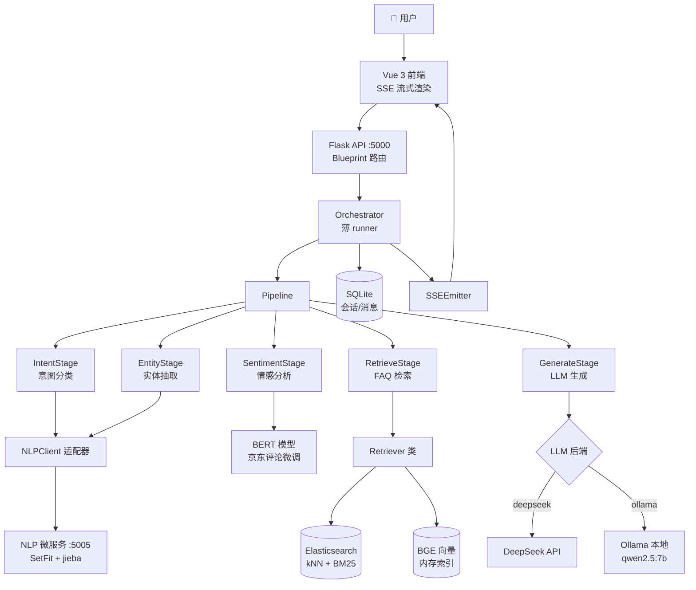
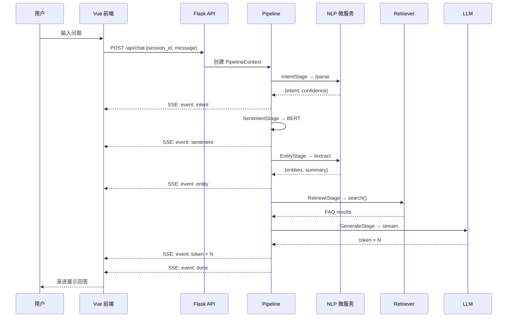

# ACSS — 电商智能客服系统

Auto Classify Support System — 基于 NLP + RAG 的电商客服智能问答系统。接收用户自然语言消息，自动完成意图分类、情感分析、实体抽取，通过 ES + BGE 混合检索 FAQ 知识库，由 LLM 流式生成回答。

## 功能

- **意图分类** — SetFit 少样本微调，7 类电商意图（退货退款、物流查询、商品咨询、订单查询、投诉、闲聊、其他）
- **情感分析** — BERT 京东评论微调模型 + 置信度阈值，正/负/中三分类
- **实体抽取** — jieba 词性标注 + 正则，7 类电商实体（订单号、手机号、金额、日期、运单号、快递公司、商品名）
- **知识库检索** — ES kNN + BM25 混合检索，三级 fallback（ES → BGE 内存向量 → 关键词）
- **LLM 流式生成** — DeepSeek API / Ollama 本地双后端，SSE 逐字推送
- **多轮对话** — SQLite 会话持久化，侧边栏历史列表，对话恢复
- **Swagger 文档** — `/docs` 交互式 API 文档

## 架构



### SSE 请求流



## 技术栈

| 层 | 技术 |
|------|------|
| 前端 | Vue 3 + Vite + Pinia |
| 后端 | Flask 3.x + flasgger（Swagger） |
| 意图分类 | SetFit + `paraphrase-multilingual-MiniLM-L12-v2` |
| 情感分析 | `uer/roberta-base-finetuned-jd-binary-chinese` |
| 向量检索 | `BAAI/bge-base-zh-v1.5`（768 维） |
| 检索引擎 | Elasticsearch 8.x |
| 实体抽取 | jieba（词性标注 + 正则） |
| LLM | DeepSeek API / Ollama（`qwen2.5:7b` Q4_K_M） |
| 会话存储 | SQLite（WAL 模式，零额外依赖） |
| 容器编排 | Docker Compose（5 容器） |

## 快速开始

### 前置要求

- Python 3.10+
- Node.js 20+
- [uv](https://docs.astral.sh/uv/)（Python 包管理器）
- Docker Desktop

### 1. 克隆并配置

```bash
git clone https://github.com/Musubit/auto-classify-support-system.git
cd auto-classify-support-system

# 复制环境变量模板
cp .env.example .env
# 编辑 .env，填入 DEEPSEEK_API_KEY
```

### 2. Docker Compose 一键启动

```bash
# 启动全部 5 个容器（ES + Ollama + NLP + Backend + Frontend）
docker compose up -d

# 如需本地 LLM，先拉取模型
docker exec acss-ollama ollama pull qwen2.5:7b

# 查看服务状态
docker compose ps
```

启动后访问：
- 前端：http://localhost
- Swagger 文档：http://localhost:5000/docs
- NLP 服务：http://localhost:5005/health

### 3. 本地开发

```bash
# ─── NLP 微服务 ───
cd nlp
uv sync
uv run python src/server.py          # → :5005

# ─── 后端 ───
cd backend
uv sync
uv run python run.py                  # → :5000

# ─── 前端 ───
cd frontend
npm install
npm run dev                           # → :5173
```

> 本地开发时需要将 `.env` 中的 `NLP_SERVER_URL` 改为 `http://localhost:5005`，`ES_HOST` 改为 `http://localhost:9200`。

### 4. NLP 模型训练

```bash
cd nlp
uv run python src/train.py
# 模型输出到 nlp/models/
```

训练数据：[`nlp/data/training.jsonl`](nlp/data/training.jsonl)（42 条，7 类 × 6 样本）。

## 项目结构

```
├── frontend/                    # Vue 3 SPA
│   └── src/
│       ├── api/index.js         # Axios + SSE 客户端
│       ├── stores/chat.js       # Pinia store
│       └── components/          # Sidebar, ChatArea, MessageBubble
│
├── backend/                     # Flask API :5000
│   └── app/
│       ├── api/                 # chat.py, session.py
│       ├── services/            # orchestrator, pipeline, nlp_client,
│       │                          retriever, sentiment, llm, db
│       ├── models/              # Pydantic ChatRequest
│       └── utils/               # SSEEmitter, response
│
├── nlp/                         # NLP 微服务 :5005
│   └── src/                     # server, predict, preprocess, extract, train
│
├── docker/                      # ES 配置
├── docs/                        # 架构、API、测试计划、开发规范
│   └── adr/                     # 架构决策记录
│
├── docker-compose.yml           # 5 容器编排
├── CONTEXT.md                   # 领域词汇表
└── .env.example                 # 环境变量模板
```

## 配置

所有配置通过 `.env` 环境变量：

| 变量 | 默认值 | 说明 |
|------|--------|------|
| `DEEPSEEK_API_KEY` | — | **必填**，DeepSeek API Key |
| `DEEPSEEK_MODEL` | `deepseek-v4-flash` | DeepSeek 模型 |
| `LLM_BACKEND` | `deepseek` | LLM 后端：`deepseek` 或 `ollama` |
| `OLLAMA_BASE_URL` | `http://ollama:11434/v1` | Ollama 服务地址 |
| `OLLAMA_MODEL` | `qwen2.5:7b` | Ollama 模型名 |
| `ES_HOST` | `http://localhost:9200` | Elasticsearch 地址 |
| `NLP_SERVER_URL` | `http://localhost:5005` | NLP 微服务地址 |
| `SENTIMENT_THRESHOLD` | `0.85` | 情感分析置信度阈值 |
| `SECRET_KEY` | — | **必填**，Flask 密钥 |
| `CORS_ORIGINS` | — | 生产环境必填，逗号分隔 |

完整配置见 [`.env.example`](.env.example)。

## API

| 方法 | 路径 | 说明 |
|------|------|------|
| `GET` | `/api/health` | 健康检查 |
| `POST` | `/api/chat` | SSE 流式聊天 |
| `GET` | `/api/sessions` | 会话列表 |
| `GET` | `/api/sessions/<id>` | 会话详情 + 消息 |
| `DELETE` | `/api/sessions/<id>` | 删除会话 |
| `GET` | `/docs` | Swagger 交互式文档 |

SSE 事件序列：`intent` → `sentiment` → `entity`（可选）→ `token`×N → `done`

详见 [`docs/api.md`](docs/api.md)。

## 文档

| 文档 | 说明 |
|------|------|
| [`docs/architecture.md`](docs/architecture.md) | 架构说明、模型选型、设计原则 |
| [`docs/api.md`](docs/api.md) | API 接口、SSE 事件约定 |
| [`docs/test_plan.md`](docs/test_plan.md) | 测试计划与验收标准 |
| [`CONTEXT.md`](CONTEXT.md) | 领域词汇表 |
| [`docs/adr/`](docs/adr/) | 架构决策记录 |
| [`docs/vibecoding/`](docs/vibecoding/) | AI 开发流程与编码规范 |

## 开发

```bash
# 语法检查
cd backend && uv run ruff check app/

# 运行 NLP 测试
cd nlp && uv run pytest tests/ -v

# 前端构建
cd frontend && npm run build
```

提交规范见 [`docs/vibecoding/git-convention.md`](docs/vibecoding/git-convention.md)。
